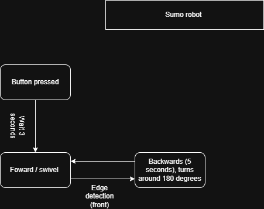
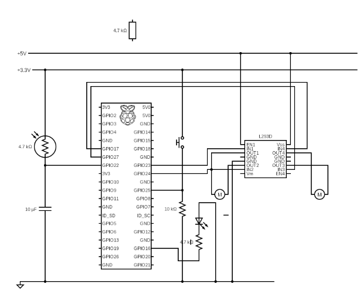

# CPT-project-comp-eng
This repo includes a readme.md file, an images file and a source code file
## Design
### What the robot needs to do
The robot should turn away from the edges of the arena, otherwise drive forward/swerve. Edge detection will be primarily used to turn away from the edges and middle of the arena. Once the robot detects an edge, it will initially start moving backwards, and then turn just enough to detect another edge. This design is primarily achieved through a photoresistor on the front of the robot with a LED. Our robot acts as a “speed bump”, essentially allowing it to go under opposing robots. Hopefully, this will allow the robot to stand it’s ground without being pushed/displaced. 

### Success Criteria
| Requirement | How you tested it | PAss condition |
| :--- | :---: | ---: |
| Must be able to distinguish between black and white | By putting the bot in the arena | Changes phases when robot touches the black line consistently |
| Make sure everything works correctly and according to the plan. | Test every single movement state separately.  | Must stay in the arena for 1+ min  |

### System architechture

### Circuit design

### Physical Layout
Add image for adrian here

## Build
The build is inspired by the design of a speed bump. The idea of a speed bump is to slow other cars down from going too fast or else they will feel an big impact. Similarily, our robot comes from below to push other opposing robots out of the arena.  We wanted this design to be much more than the guided build. The guided build was a good baseline, but not nearly enough to reach our goal. More importantly, we wanted to challenge ourselves to make something truly unique. This meant going beyond the guided build, and beyond supervision. This would be more challenging than anticipated. There was certainly a big gap between our skils and what we thought we could accomplish. Not that it was impossible, but out of our comfort zone. To build something requires careful and effective planning. Unknowingly, we would pay the price for this mistake. Every new step foward introduced/revealed more flaws. When we realized it was already too late. The final build is more of an improvision, caused by our countless mistakes. It is not the true final build. 
### Chassis
The chassis is the first part that was constructed. The chassis dictated how the entire build would go, so it was a crucial point during production. In contrast to the guided build, our build was a little different. Every component needed it's own layer. A tight build is clumpured and looks messy. The goal was to have a large base, while also being low to the ground. As for the materials, the base is made up of a 3d printed layer, and the ramps are made out of cardboard. The chassis took the longest amount of time to build, due to how easy it is to mess up. Everything fit perfectly on the base of the chassis. Every component was locked in place without the risk of falling out. 
### Wiring
The wiring setup is functional, but not organized. The ribbon cable is not folded properly, and cable management is subpar. On the positive side, the routing logic works fantastic. The robot executes the code without any problems. Wires are not at risk of getting caught on moving parts. The cables themselves are not at risk of disconnecting. The button is located on the other side of breadboard, allowing for easy access. Some improvements include folding the ribbon cable and trimming any excess wire length to fix floating wires. This would not require rerouting, just cleaning up the wires. 
### Decisions made during the build
1. Short circuit risk
During testing, the robot kept disconnecting and sensor values seemed off. Wiring seemed to be the issue. The metal from two wires would touch, creating a risk of a short circuit. It seemed like a minor detail at first when the robot started moving, but revealed itself to be an even bigger issue than expected. After testing, the wires are rerouted in a way to ensure no short circuits happen. This problem only becomes evident when the robot starts moving. It is not a problem you can see just by looking at the wires.
2. Turning behavior
A robot cannot just turn wherever it wants in any direction. Each turn is a calculated movement to sustain for longer. Turns are simple without any external factors. The arena introduced many new factors that we just did not account for. So,  when testing the robot, it either turned too little or too much. After the turning amount was adjusted, the robot could keep moving within the boundaries of the arena for much longer. The actual behavior on the floor is much more complicated than expected. Proper testing revealed minor tweaks in the code that would not have been discovered otherwise. 
Tired inside rather than outside
### Callibration

## Code
### Project structure
### [Name this section after the algorithm, e.g. Edge Detection]

### [Name this section after the next key algorithm, e.g. Main Loop]

### GPIO Cleanup

## Competition & Reflection

### Results
| Round | Placement | Bonus points | Total |
| --- | --- | --- | --- |
| Round 1 | 1st | 0 | 3 |
| Round 2 | 4th | 0 | 0 |
| Round 3 | 2nd | 0 | 2 |
| Round 4 | 4th | 0 | 0 |
| Round 5 | 1st | 2 | 5 |
| Round 6 | 3rd | 0 | 1 |
| Total   | 5th | 2 | 11|
### What worked
On competition day, multiple aspects of the build really came through. Firstly, The code worked surprisingly well. At first glance, the code does not look too complex and appears to be more simplistic. There were doubts about whether the robot could even keep up with the other robots with larger size and special sensors. However, this also allowed our robot to perform it's movements consistently. During the competition, the majority of the competitors' robots either malfunctioned or got disqualified, while our robot could perform the same way in every single match. Additionally, the robot could adapt aswell. It was quite easy to change the code between matches in order to adapt to the other robots. As for the hardware, it worked good too. The wider base, allowed for our robot to potentially push any smaller robots out of the arena. This proved helpful in a lot of situation on competition day. Overall, I would not change anything about the build, except for minor hardware improvements. Everything worked as expected. 
### What failed
Each mistake really set our score back. If not for those mistakes, our team could have gottten a better placement in the competition. Most of the mistakes are found in the actual hardware. The decision to put wheels at the sides of the build backfired. Initially the idea was to have the wheels inside, so they could not be trapped or pushed. The only reason we decided to cut it out was because the wheels simply could not fit. Every single time, the wheels would get stuck on an edge or in the middle of the arena, leading to an early elimination. The ramp on the front did not fulfill the vision of a speed bump we were looking for. At certain times, the ramp actually got stuck on the floor. The ramp neither performed well nor fit expectations. As a result, this led to more points being deducted. Another design issue were the placement of the LED and photoresistor. Both parts would take a beating every single round by smashing into other robots repeatedly. The bot could definitely execute its prompts, but without a good build, the prompts got overshadowed. 
### Next iteration
As much as seeing your failures sucks, they provide feedback, which leads to a better overall performing robot. In hindsight, the robot could have definitely used some changes to it's design. The robot never truly reached it's fullest potential. The bad ultimately outweighed the good of our robot in the end. The ideal robot minimizes it's weaknesses, and brings out its stengths. Our robot failed to accomplish this feat. One of the biggest mistakes that held our robot back was the tire placement. The wheels should have been on the inside of the robot, so that the wheels did not get trapped in place. The only reason, this idea got scrapped is because the wheels were simply too large. When planning the idea, the wheels never got measured, so when the wheels did not fit it was already too late to make a change. So, next time measuring every component seperately and giving ourselves the proper amount of time to measure each component seperately is in our best interest. Another area of improvement is found in the ramp. The idea was for the speed bump to come from below, but clearly that did not happen. Furthermore, the sides and back of the robot were exposed. The original design incorperated four ramps on each side of the robot. The wheels on the outside of the robot prevented this idea from coming to life. This left the robot vulnerable at all times. The four ramps would have protected the robot from every single angle without limiting it's movement. Through this project, we learned the drawbacks of poor planning and how to bounce back from this setback. This will be put into consideration when doing any other project of some kind. 
